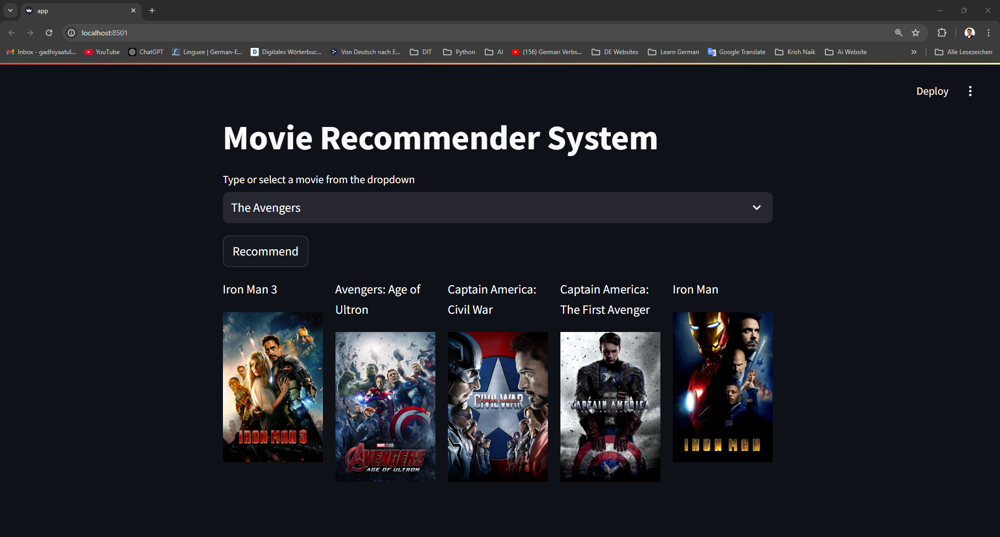
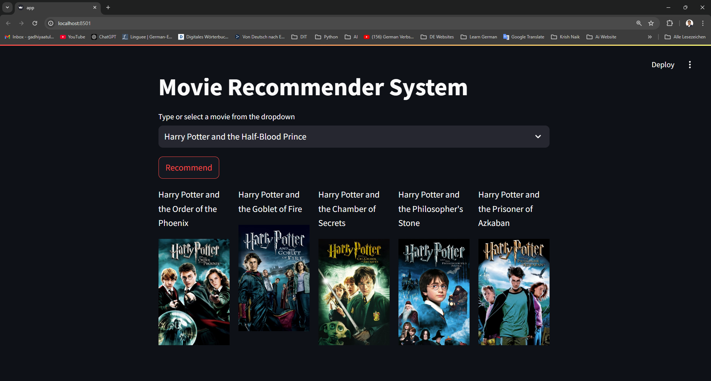
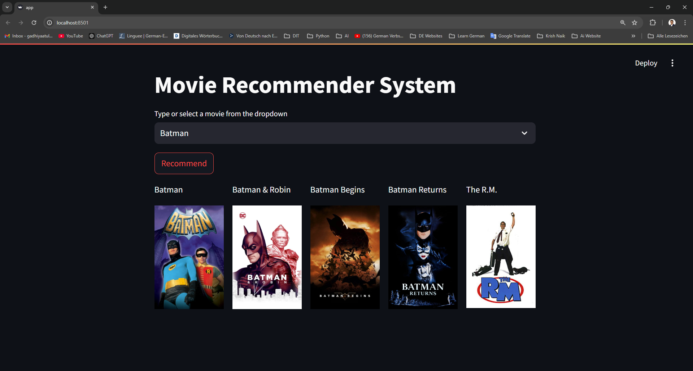

# Movie Recommender System

## Overview
The **Movie Recommender System** is a machine learning-based project designed to recommend movies to users based on their preferences. The system utilizes collaborative filtering and content-based approaches, leveraging the TMDb dataset for its analysis and predictions.

### Features
- **Content-Based Filtering**: Recommends movies similar to the input movie based on features like genres, cast, crew, and keywords.
- **Collaborative Filtering**: Suggests movies by finding patterns and relationships in user data.
- **User-Friendly Interface**: Outputs movie recommendations based on cosine similarity metrics.

---

## Dataset
The project uses the [TMDb Movie Metadata Dataset](https://www.kaggle.com/datasets/tmdb/tmdb-movie-metadata), which contains:
- Movie metadata (e.g., budget, genres, cast, crew, popularity, release date, runtime).
- Information on movie credits and keywords.

---

## Steps to Build the System

### Step 1: Introduction
- The project defines a clear goal of creating a recommender system using the TMDb dataset.
- It employs feature engineering and text vectorization techniques for recommendations.

### Step 2: Data Loading
- The datasets are imported and loaded using `pandas`.

### Step 3: Data Cleaning and Preprocessing
- Merging datasets to create a unified data frame.
- Extracting relevant features such as genres, cast, and crew.
- Applying parsing techniques to clean JSON-like data.

### Step 4: Feature Engineering
- Combining features like genres, keywords, and cast into a single `tags` column.
- Vectorizing text data using the `CountVectorizer` from `sklearn`.

### Step 5: Similarity Computation
- Computing cosine similarity between vectorized features to measure the closeness between movies.

### Step 6: Recommendation Function
- A Python function takes a movie title as input and returns a list of recommended movies.

---

### Code to See the Result
```python
movie_name = 'Avatar'
print(f"Recommendations for {movie_name}:")
print(recommend(movie_name))
```

### Output
```
Recommendations for Avatar:
['Aliens', 'Guardians of the Galaxy', 'Star Wars: The Force Awakens', 'Star Trek', 'The Avengers']
```

### Results

**Recommendations Output**

Below are screenshots showcasing the system in action:

1. **Recommendations Output**
   

2. **Recommendations Output**
   

3. **Recommendations Output**
   


---

## Installation
### Requirements
- Python 3.7+
- Libraries:
  - numpy
  - pandas
  - sklearn
  - ast (built-in)


## Future Enhancements
- Incorporate user-specific data to personalize recommendations further.
- Explore hybrid recommendation systems combining collaborative and content-based filtering.
- Deploy the system as a web or mobile application for wider usability.

---

## Acknowledgments
- TMDb for providing the movie metadata dataset.
- Open-source libraries like NumPy, Pandas, and Scikit-learn for enabling efficient computation.

---

## License
This project is licensed under the MIT License. See the `LICENSE` file for details.

---

Feel free to explore, modify, and contribute to this project. Happy Coding! 🚀
